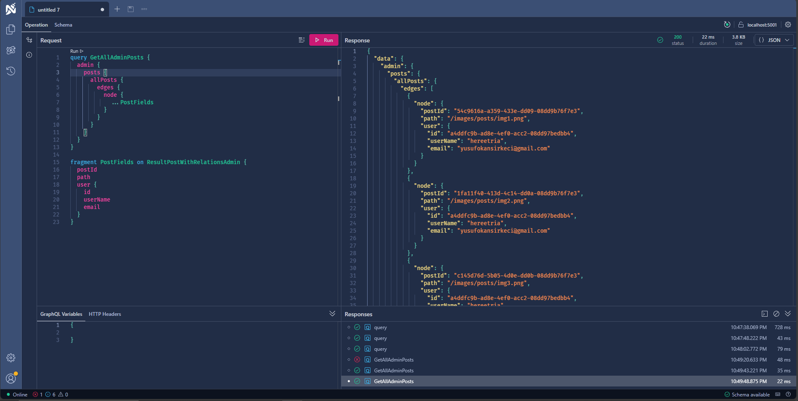
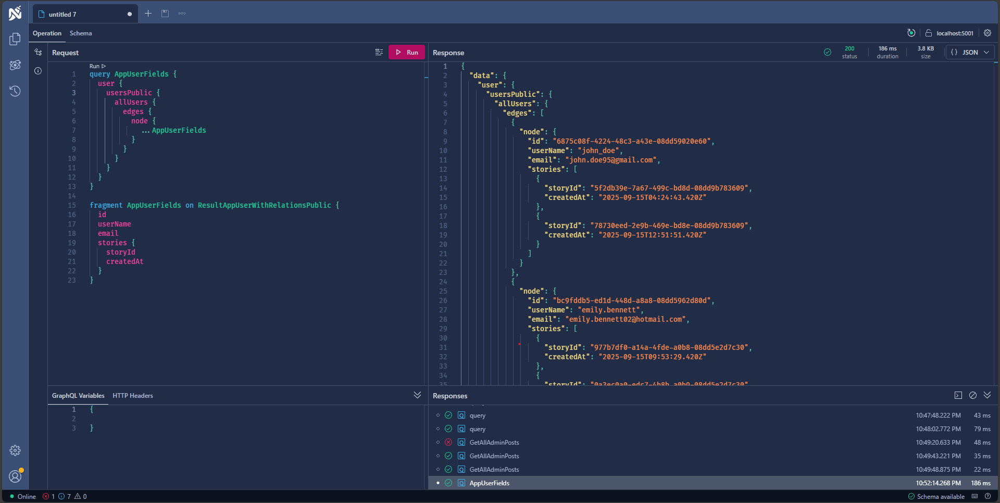

# 🧠 XenoTerra_API — Modular, High-Performance GraphQL Backend for Modern Applications

<br>

[](../../issues/new?labels=bug)
[](../../issues/new?labels=enhancement)

<br>

## 📌 Project Overview

XenoTerra_API is a **modular**, **scalable**, and **high-performance GraphQL backend** built with .NET Core and HotChocolate.  
It mirrors the behavior of a real-world social media backend, focusing on **clean architecture**, **dynamic GraphQL capabilities**, and **developer-friendly patterns**.

**Highlights:**
- 🧠 Modular structure aligned with clean architecture principles  
- 📝 Full CRUD support with dynamic GraphQL query construction  
- ⚡ Real-time event delivery via subscriptions  
- 🧮 Advanced filtering, sorting, and pagination logic  
- 🧩 Custom projection and expression building  
- 🧰 Centralized error handling and type-safe responses  
- ♻️ Reusable patterns for flexible query composition

<br>

## ✨ Features

### 🧱 General Architecture
- Layered (n-tier) architecture with clear responsibilities per layer.  
- GraphQL schema input flows through all layers to produce the final output efficiently.

---

### 🚀 GraphQL-Based API
- Core built on **GraphQL** using **HotChocolate**.  
- Full support for **queries**, **mutations**, and **subscriptions**.  
- Implements advanced GraphQL features:
  - 📄 Pagination  
  - 🔍 Filtering & Sorting  
  - ✅ Input validation  
  - 📦 Payload handling  
  - 🧠 DataLoader integration  
  - 🧰 Attribute-based configurations  
  - 🧭 Middleware extensions

---

### 📊 Query
- Dynamically builds queries based on requested fields.  
- Centralized error handling with proper GraphQL exception usage.  
- Collections returned as `Connection` objects; single entities returned directly.

---

### 🔭 Projection
- Fetches only requested fields using runtime expression trees.  
- Supports nested relational entities without over-fetching.  
- Optimized for maximum performance.

---

### 📑 Pagination
- Custom `Connection` class handles pagination for all collections.  
- `totalCount` is fetched **only if explicitly requested**, avoiding extra DB calls.

---

### ↕️ Sorting
- Sorting via `order` parameter, supporting nested fields.  
- Dynamic generation of sorting expressions with ASC/DESC options.

---

### 🔍 Filtering
- GraphQL `where` parameter supports AND/OR logic and rich operators.  
- Filter expressions injected dynamically into the query pipeline.

---

### 🧠 Custom Enhancements over HotChocolate
- Extends built-in HotChocolate mechanisms where beneficial.  
- Delivers more flexibility and better performance than default setup.  
- Minimizes backend change requests from frontend teams.

---

## ✍️ Mutation
- Uses custom input types following GraphQL best practices.  
- Only GraphQL-supported types allowed; mapped to internal DTOs.  
- Returns customizable payloads with structured error handling.

---

## 📡 Subscription
- Observes entity events through subscription methods.  
- Dispatches customizable payloads to subscribers.

---

### 🧠 GraphQL-Specific Enhancements
- **DataLoader**: Eliminates N+1 problems with selective field retrieval.  
- **Attributes**: Custom attributes for fine-grained control.  
- **Middlewares**: Handle cross-cutting concerns cleanly.  
- **Resolvers**: Structured resolvers ensure layered validation and transformation.

---

### 🏗️ Code Quality & Architecture
- 🔒 Admin/User DTO separation for data security.  
- 🧠 Strong type support for all major structures.  
- ✍️ Clean, maintainable codebase.  
- 📁 Organized folder structure.  
- 🧭 Consistent naming conventions.

<br>

## 🖼️ Screenshots
Shown below in order:  
**1. Admin Posts Query** · **2. Users Public Query**

<p align="center">
  
  
  
</p>

<br>

## 🧰 Tech Stack

<p>
  
  
  
  
  <br>
  
  
</p>

<br>

## 📥 Installation

```bash
# Clone the repository
git clone [repository-url]
cd XenoTerra_API

# Install dependencies
dotnet restore

# Apply EF Core migrations
dotnet ef database update

# Run the API
dotnet run
```

<br>

## 📜 License

[](LICENSE)

This project is licensed under the terms described in the [LICENSE](./LICENSE) file.

---

© 2025 Yusuf Okan Sirkeci — [Hereetria](https://github.com/Hereetria)
